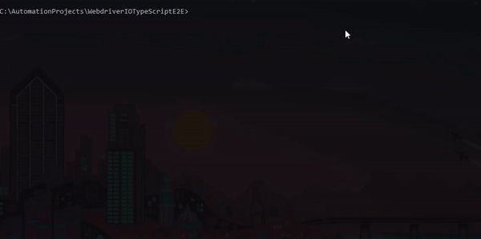

<h2 align="center"> Web, API and Mobile Test Automation Framework </h2>

<h4 align="center">


[](https://github.com/sadabnepal/WebdriverIOTypeScriptE2E/actions/workflows/web.yml)
[](https://github.com/sadabnepal/WebdriverIOTypeScriptE2E/actions/workflows/api.yml)

</h4>

#### Requirements
[](https://nodejs.org/en/download/)
[](https://www.oracle.com/java/technologies/downloads/)
[](https://docs.docker.com/engine/install/)
[](https://code.visualstudio.com/download)
[](https://github.com/appium/appium-inspector/releases)
[](https://developer.android.com/studio)

#### Clone Repository
```bash
1. git clone https://github.com/sadabnepal/WebdriverIOTypeScriptE2E.git
2. Navigate to `WebdriverIOTypeScriptE2E`
```
-----

### Interactive CLI to run test:
> Make sure mobile setup has been completed if selecting mobile as CLI option. See [Mobile Test](#Mobile-Test) for setup instructions. Before running actual test, presence of node_modules folder will be validated and if not not found installation will take place before proceeding any furthur.
```bash
npm start
```
It start wizard with test module options, based on user selection either of the below module will start <b>locally</b> or inside <b>docker container</b>. Code to control wizard and user selection is available in 'start.js' which is built using [enquirer](https://www.npmjs.com/package/enquirer) node package.<br>
<b>Test Module Options : </b> | UI | API | Mobile | <br>



-----

### Web Test
Install dependencies:
> Navigate to "web" folder and then run below command
```bash
npm install
```

Setup .env file:<br>
create `.env` file inside web folder and update content with reference to `.env.example`

Run test in local:
> By default test will run in HEADLESS mode.
> Update MODE=LOCAL in .env file to see test running in browser.
```bash
npm test             [ Mocha tests ]
npm run test:e2e     [ Cucumber BDD tests ]
```

Run test in Docker:
```bash
npm run test:docker       [ Mocha tests]
npm run test:e2e:docker   [ Cucumber BDD tests ]
```
> Pre and Post script will handle start and stop of docker containers automatically.
> If containers does not stop automatically run "docker-compose down" command.

Generate Report:
```bash
npm run report:mocha
npm run report:cucumber
```

Report Paths:
```bash
mocha: web/mochawesome-report/mochawesome-report.html
cucumber: web/reports/cucumber/cucumber-report.html
```

Send Report:
> Update .env file details with reference of .env.example file
```bash
npm run mailCucumberReport
npm run mailMochaResult
```
-----

### API Test
Install dependencies:
> Navigate to "api" folder and then run below command
```bash
npm install
```

Run test:
```bash
npm test
```

Report Paths:
```bash
api/reports/mochawesome.html
```

-----

### Mobile Test

Appium setup: [Click here to open Appium SetUp README](/mobile/README.md)

Install dependencies:
> Navigate to "mobile" folder and then run below command
```bash
npm install
```

Run in local:
> Make sure android virtual device is up and running before starting mobile test.
```bash
npm run test  [ Mobile tests ]
```

Generate Report:
```bash
npm run report
```

Report Paths:
```bash
mobile: mobile/reports/mobile.html
```

-----

#### Features:
    - Web, Mobile and API Testing
    - Mocha and Cucumber BDD framework
    - Page Object Design pattern
    - Docker with VNC integration
    - Parallel execution
    - Cross browser testing
    - Retry failed test
    - Screenshot in report for failed tests
    - Github actions
    - Send test report to list of Gmail
    - Use of types for method params optimization
    - Improved import statement using tsconfig path

#### Tech stacks:
[](https://webdriver.io/)
[](https://www.typescriptlang.org/)
[](https://mochajs.org/)
[](https://cucumber.io/)
[](https://www.chaijs.com/)
[](https://github.com/visionmedia/supertest)
[](https://github.com/enquirer/enquirer)
[](https://www.docker.com/)
[](https://github.com/appium/appium)
[](https://github.com/nodemailer/nodemailer)

#### Folder Structure:


#### Sample Email Report:
